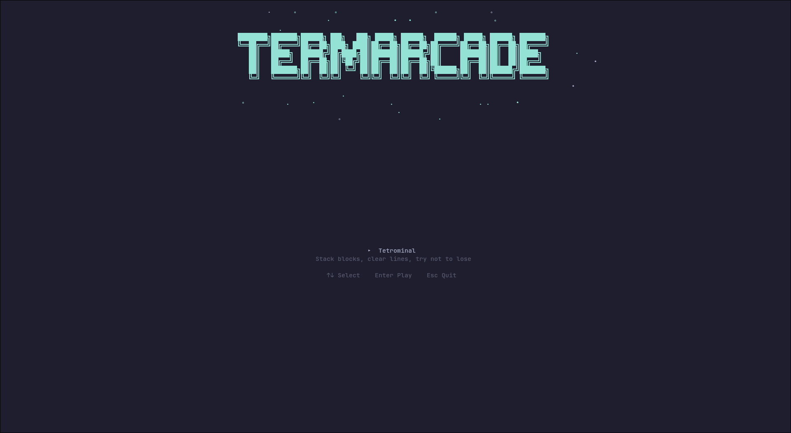
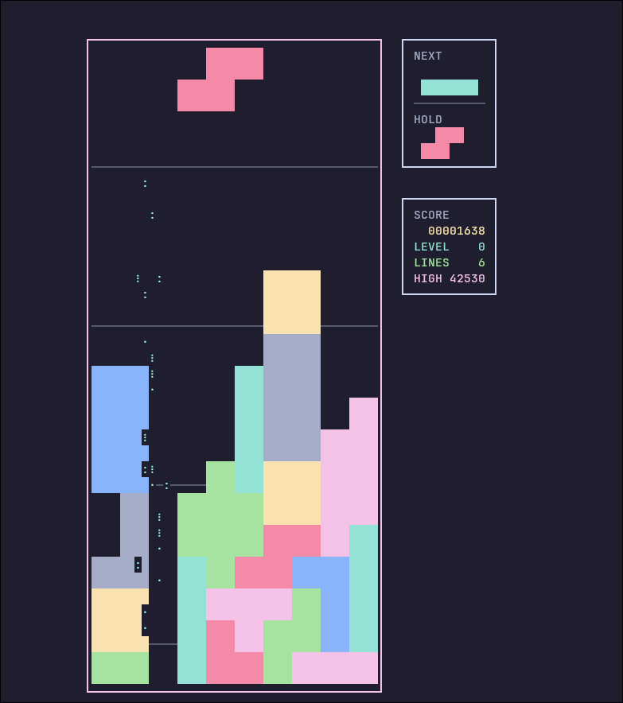

# termarcade

A quick terminal arcade to waste your time.

No fancy graphics, no bloat — just classic minigames running in your terminal.

## Screenshots





## Games

- **Tetrominal** — Stack blocks, clear lines, try not to lose.

## Install

### Prerequisites

You need **Rust** and **Cargo**. Install them with [rustup](https://rustup.rs) (works on every distro):

```bash
curl --proto '=https' --tlsv1.2 -sSf https://sh.rustup.rs | sh
```

Or use your distro's package manager:

- **Debian / Ubuntu / Linux Mint**
  ```bash
  sudo apt install rustc cargo
  ```

- **Arch / Manjaro / EndeavourOS**
  ```bash
  sudo pacman -S rust
  ```

- **Fedora**
  ```bash
  sudo dnf install rust cargo
  ```

- **openSUSE**
  ```bash
  sudo zypper install rust cargo
  ```

- **Void Linux**
  ```bash
  sudo xbps-install rust cargo
  ```

- **Gentoo**
  ```bash
  emerge dev-lang/rust
  ```

### Build & install

```bash
git clone https://github.com/Maxilure/termarcade.git
cd termarcade
cargo install --path termarcade
```

Then run:

```bash
termarcade
```

### Usage

```
termarcade                  Launch the arcade menu
termarcade tetrominal       Open Tetrominal to its menu
termarcade tetrominal c     Start Classic mode immediately
termarcade tetrominal r     Start Relaxed mode immediately
termarcade list             List available games
termarcade -h               Show this help
```

## License

See [LICENSE](LICENSE).
